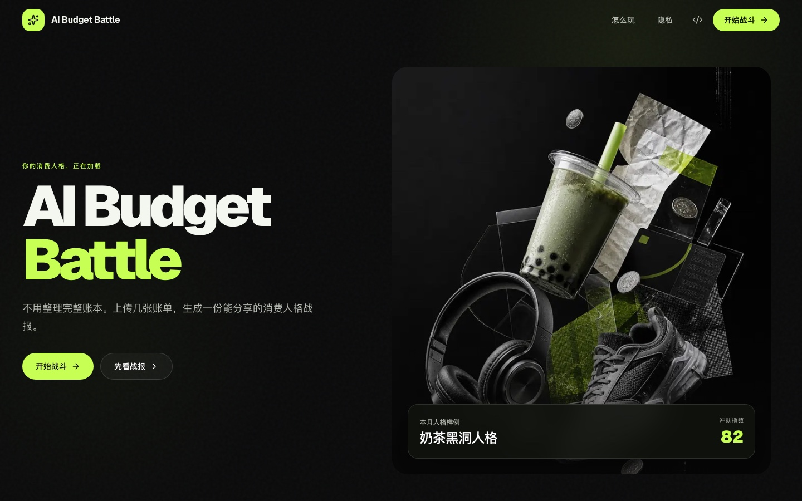

<div align="center">

# AI Budget Battle

**把几张消费记录，变成一份好笑、清晰、能分享的人格战报。**

[在线体验](https://ai-budget-battle.vercel.app) · [产品文档](./memory-bank/design-document.md) · [参与贡献](./CONTRIBUTING.md)

</div>



AI Budget Battle 是一个面向学生的中文消费人格产品。用户可以上传月度总结、几张代表性账单，或手动补充消费记录；确认识别结果后，系统会生成一套 Cyber Wrapped 风格的人格、吐槽、分数和分享卡。

它不是传统记账工具，也不做真实校园排名。这个项目想验证一个更简单的问题：学生会不会愿意确认少量消费数据，然后分享一份有趣但不过界的 AI 消费人格报告？

## 体验流程

| 输入 | 确认 | 揭晓 | 分享 |
|---|---|---|---|
| 上传少量截图或手动补充 | 修改金额、分类和估算项 | 浏览 8 屏人格故事 | 导出小红书或朋友圈卡片 |

整个流程默认匿名可体验。保存历史、去水印、追加导出和重复生成时才需要登录。

## 当前能力

- 中国大陆学生与留学生两条初始化路径
- 月度总结、代表性日账单、分类汇总和手动输入
- Mock-first AI 识别与报告生成，完整流程无需真实密钥
- 可编辑的交易确认与低置信度提示
- 8 屏 Cyber Wrapped 消费人格故事流
- 小红书方图、竖图和微信朋友圈分享卡
- 匿名体验、登录门槛、历史战报和轻量数据面板
- 可选的 OpenAI 与 Supabase 服务端 provider
- Vitest 单元测试与 Playwright 端到端回归

## 设计方向

视觉系统使用炭黑、银灰和单一酸性青柠绿。首页采用非对称编辑式布局，流程页保留高密度赛博信息感，但避免做成传统金融 dashboard。

产品文案遵循三条边界：

- 可以调侃消费习惯，不攻击身份、收入或家庭背景。
- 只把预设数据称为学生基准，不伪装成真实排名。
- 分享卡默认隐藏商户和逐笔交易明细。

## 技术栈

| 层级 | 方案 |
|---|---|
| Web | Next.js App Router, React, TypeScript |
| UI | Tailwind CSS, Motion, Recharts |
| 表单与校验 | React Hook Form, Zod |
| 数据与登录 | Mock providers, Supabase boundary |
| AI | Mock AI, optional OpenAI provider |
| 分享卡 | HTML/CSS templates, html-to-image |
| 测试 | Vitest, Playwright |
| 部署 | Vercel |

## 本地启动

### 环境要求

- Node.js 20 或更高版本
- pnpm 11.x

### 安装与运行

```bash
pnpm install
cp .env.example .env.local
pnpm dev
```

打开 [http://localhost:3000](http://localhost:3000)。默认 Mock 模式不需要 Supabase 或 OpenAI 密钥。

### 质量检查

```bash
pnpm lint
pnpm typecheck
pnpm test
pnpm e2e
pnpm build
```

## Provider 模式

默认配置适合本地演示：

```bash
PERSISTENCE_PROVIDER=mock
AUTH_PROVIDER=mock
AI_PROVIDER=mock
AI_REPORT_PROVIDER=mock
NEXT_PUBLIC_APP_URL=http://localhost:3000
```

如果要启用真实 AI，请只在服务端设置 OpenAI 变量：

```bash
AI_PROVIDER=openai
AI_REPORT_PROVIDER=openai
OPENAI_EXTRACTION_MODEL=your-extraction-model
OPENAI_REPORT_MODEL=your-report-model
OPENAI_API_KEY=your-server-side-key
```

如果要启用持久化和真实登录，请配置 Supabase 并切换 provider：

```bash
PERSISTENCE_PROVIDER=supabase
AUTH_PROVIDER=supabase
NEXT_PUBLIC_SUPABASE_URL=
NEXT_PUBLIC_SUPABASE_ANON_KEY=
SUPABASE_SERVICE_ROLE_KEY=
```

数据库迁移与种子文件位于 [`supabase/`](./supabase)。不要把服务端密钥放进 `NEXT_PUBLIC_*` 变量。

## 项目结构

```text
app/                     页面、Route Handlers 与 Server Actions
components/              共用 UI、故事流与分享卡
lib/                     视图模型和产品工具函数
server/                  Provider、校验、报告、存储与会话边界
types/                   共享领域类型
tests/                   Vitest 单元测试
e2e/                     Playwright 浏览器测试
supabase/                数据库迁移与种子数据
memory-bank/             产品、架构、计划与进度记录
public/editorial/        首页视觉与仓库预览素材
public/personas/         消费人格角色素材
```

## 隐私与演示说明

- 原始截图按临时分析资产处理，目标保留时间不超过 24 小时。
- 当前线上演示默认使用内存 Mock persistence，Serverless 实例切换可能重置会话。
- 不要向公开演示上传敏感金融材料。可以使用手动输入体验完整流程。
- 真正的跨设备历史记录和长期持久化需要启用 Supabase provider。

## 贡献与许可

提交改动前请阅读 [`CONTRIBUTING.md`](./CONTRIBUTING.md)，并同步维护 `memory-bank/` 中的项目记录。

本项目使用 [MIT License](./LICENSE)。
